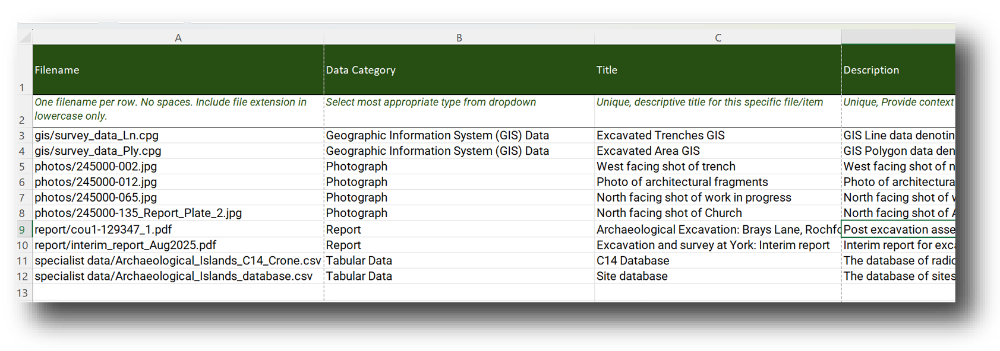

When depositing files in the Ingest system you can structure your data in one of two ways:

* Deposit all your files within a single folder  
* Deposit your files within a series of sub-folders contained within a single folder

The easiest method for depositing your files is to save all of your files within a single folder and then drag and drop that folder into the Ingest system. However, you may have organised your files within a specific and logical [data structure](https://archaeologydataservice.ac.uk/help-guidance/instructions-for-depositors/data-structure/) that relates to your project. If so, this folder structure can be accommodated within the Ingest process and be reflected in the final web interface once your data is live. To ensure the system will recognise your files, include the sub-folder name within the filename in the metadata template. 

### An example

Your fieldwork project is separated into a series of subfolders, that reflect the types of files that are to be deposited. For example:

````
project/
    └─ gis/
    └─ report/
    └─ photos/
    └─ specialist data/
````

These folders can be accommodated in the metadata template by pre-fixing the filename with the corresponding subfolder name. For example: 

* gis/Shapefile.shp  
* report/012345_Archaeological_Site_London_Report.pdf  
* photos/Photograph_001.jpg  
* specialist data/012345_EnviroDatabase.accdb

Here's an example of correctly referenced subfolder files in the metadata template:

<figure markdown="span">
  { width="650" }
  <figcaption></figcaption>
</figure>
