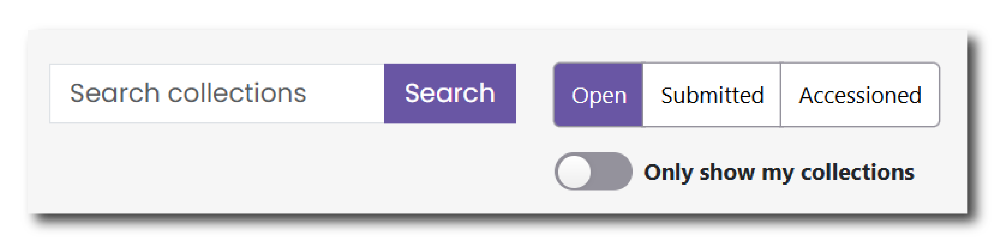
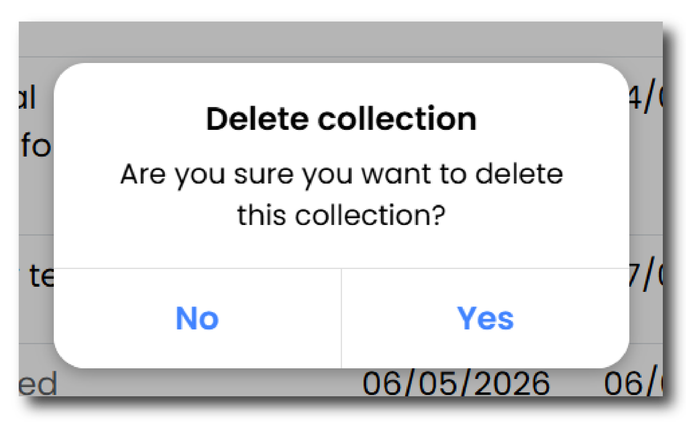

# Collections List

The Collections List is accessed via the toolbar along the top of the page. This menu provides a full list of any active or submitted collections undertaken by you or by someone in your organisation. 

## Filters

Navigate your collections using the filters or the search bar at the top of the page . Click ‘Open’, ‘Submitted’ or ‘Accessioned’ to filter your collections by its Status. Click 'Only show my collections' to filter the list to collections you are working on rather than entries for your organisation as a whole.

<figure markdown="span">
  { width="450" }
  <figcaption></figcaption>
</figure>

## Status

The status of the collection, located at the end of each row, will determine what you can do with the collection. 

* __Open__ - You have started entering information about your collection but have not yet submitted.
* __Submitted__ - You have completed and submitted your collection to one of our archivists, who is now checking that the data and metadata meets our accession requirements.
* __Accessioned__ - The deposition is now complete and is now accessioned into our archives. The data will now be archived into our collections and will soon be visible via our catalogues.

Click the { width="25" } next to each field name to open a help menu and find out more about what the field means.

Click the ‘View’ button at the end of each row to open the Collection page, view your input and save new information. 

## Deleting a Collection

To delete a collection that you have not yet submitted, find the row that relates to that Collection and then navigate to 'Status' on the right hand side of the Collections List.

To delete the collection, click the drop down arrow next to 'View' and select 'Delete' A warning will be shown asking whether you are sure you want to delete the collection. 

<figure markdown="span">
  { width="300" }
  <figcaption></figcaption>
</figure>

To confirm click 'Yes' and the collection will be deleted from your Collections List.

!!! warning

    Please note that it is not possible to recover a collection once it has been deleted

## Changes to a submitted Collection

If you wish to make a change to a collection that has already been submitted, you will need to request that it be reopened by one of our archivists. This can be done by sending a [Message](gs_messages.md) or contacting the [Helpdesk](https://archaeologydataservice.ac.uk/contact/).