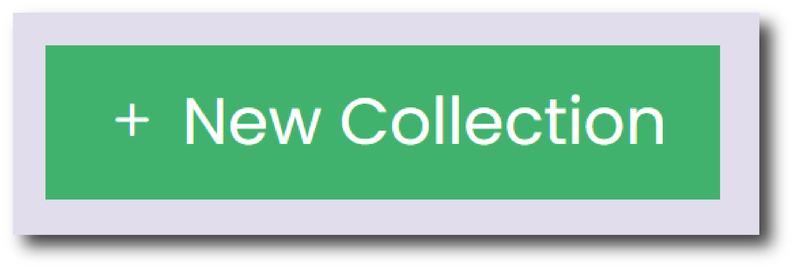

# Dashboard

The Dashboard is the default homepage when you [sign in](https://public.ads.ac.uk/ingest/login) to __Ingest__.

The bar chart provides a graphical interface to the collections that you have started working on, organised by status.

<figure markdown="span">
  { width="450" }
  <figcaption></figcaption>
</figure>

Click on the bars in the chart to automatically be taken to the [Collections List](./gs_collections.md) page and filtered by Collection Stats.

If you have any collections that have been started but have remained inactive for a long period of time, then they will be listed on the Dashboard page. These collections will be automatically deleted after 12 months of inactivity.

Click the green button at the top of the page to start a ‘New Collection’.

<figure markdown="span">
  { width="250" }
  <figcaption></figcaption>
</figure>