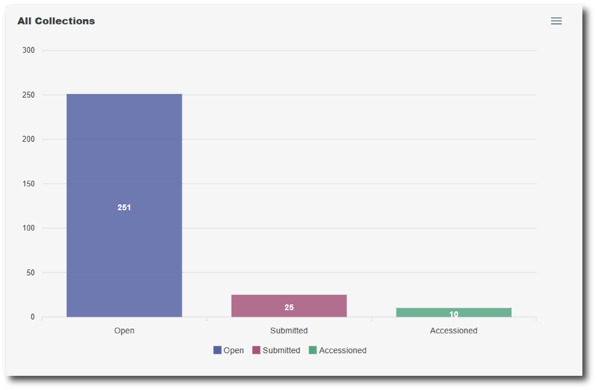

# Dashboard

The Dashboard is the default homepage when you [sign in](https://ingest.archaeologydataservice.ac.uk/) to Ingest.

The bar chart provides a graphical interface of the collections that you have started working on, organised by status.

<figure markdown="span">
  { width="450" }
  <figcaption></figcaption>
</figure>

Click a bar in the chart to go to the [Collections List](./gs_collections.md) page, filtered by Collection Status.

Click the green button at the top of the page to start a ‘New Collection’.

<figure markdown="span">
  [{ width="250" }](../nc/nc_index.md)
  <figcaption></figcaption>
</figure>

If you have any collections that have been started but have remained inactive for a long period of time, then they will be listed on the Dashboard page. These collections will be automatically deleted after 12 months of inactivity.