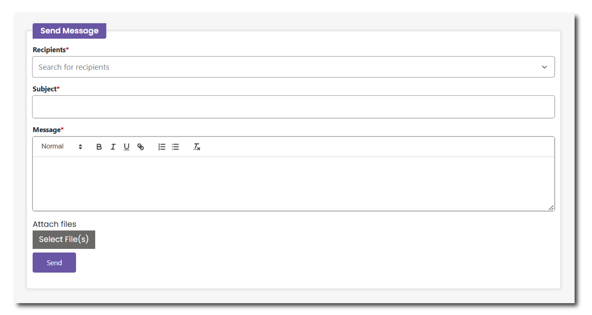

# Messages

Use the Messages menu to communicate with the archivists who are processing your collections, as well as any collaborators who may be working on your collections. This could include messages about multiple collections.

__Recipients__: Search for a recipient using their name or email address. The menu will autocomplete a recipient from an approved list.

__Subject__: Add a subject line, just like an email. Make it as clear as possible so that the archivist can best help you.

__Message__: Write your full request in the message field. Include as much information as possible so that the archivist can best help you.

<figure markdown="span">
  { width="550" }
  <figcaption></figcaption>
</figure>

All of your messages will appear on the top of this page after you send them. You can reply to each thread separately to keep all of your communications in one place.