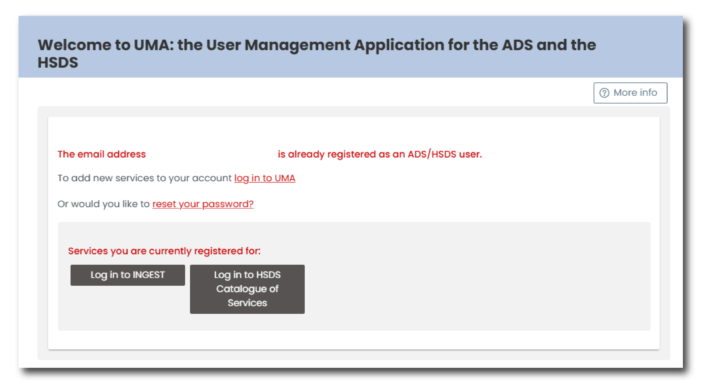

# How to register

To use Ingest, you will first need to register via the [User Management Application](https://archaeologydataservice.ac.uk/uma/index.xhtml) (UMA). You can access this system on the Ingest homepage by clicking 'Create an Account' under the login panel.

<figure markdown="span">
  { width="550" }
  <figcaption></figcaption>
</figure>

## User Management Application

UMA is a centralised platform for managing user accounts and access permissions across ADS and HSDS services. You can use UMA to manage your own personal data and, if an Admin user, manage users for your organisation.

<figure markdown="span">
  { width="550" }
  <figcaption></figcaption>
</figure>

For more information see the [UMA help pages](https://archaeologydataservice.ac.uk/uma/help.xhtml#register). 

### Register with UMA

To register with UMA, enter your email address and complete the reCAPTCHA verification. Complete the following details on the registration form:

* First name
* Last name
* Email address (please note that all communications from UMA will be sent to this email address)
* Password
* ORCiD - The sixteen digit reference number associated Open Researcher and Contributor ID ( [ORCiD](https://orcid.org/) ).
 
You will then need to accept the Terms and Conditions and Privacy Policy by selecting the boxes next to each and press "save details". 

After submitting the registration form, you will receive a verification email. Check your inbox and click the verification link to activate your account.

Once registered for UMA you then will be able to manage your personal account details and register for access to Ingest.

### To check if you have an account

If you have used ADS or HSDS applications in the past, including [OASIS](https://oasis.ac.uk/) or the [HSDS Catalogue of Services](https://hsds.ac.uk/services-catalogue), you may already have an account in UMA. 

To check, enter your email in the registration page. If you have an existing account you will see a notification, including a list of the services you are currently registered for. From this page you can 'log into UMA' or 'reset your password'.

<figure markdown="span">
  { width="450" }
  <figcaption></figcaption>
</figure>

### To register for Ingest

Once you have accessed UMA, you must now request access to Ingest.

To do this log into UMA and navigate to the menu in the top right corner of the page, where you name is listed. Click the drop down and select 'Join new sys/org'. In this menu you are able to request access to use Ingest for a specific organisation. 

Complete the following steps:

1. Under System select 'Ingest' from the drop down list.
2. EITHER select from one of 'Your Current Organisations' or 'Choose an organisation' by typing its name into the relevant box.

UMA will only allow you to select from existing organisations. If your organisation does not currently appear in this list click the 'Add a new organisation' button at the bottom of the menu.

Once you have completed this form, an email will be sent to an Admin user from your organisation, who will be able to accept your request. Once your request has been accepted, you will receive a notification email from UMA and you will now be able log into Ingest.

If you do not know who the Admin user is for your organisation, please [contact the Helpdesk](https://archaeologydataservice.ac.uk/contact/) for more information.

# Logging into Ingest

To log into the Ingest system, navigate to the [login page](https://ingest.archaeologydataservice.ac.uk/login?next=/) and enter your email address and password.

!!! info

    The email address and password for logging into Ingest will be the same login details that you used to log into UMA.
