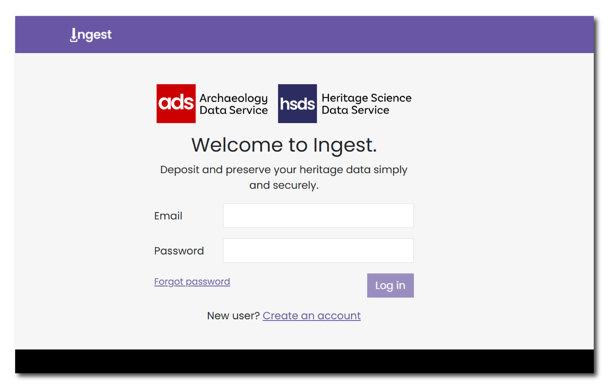
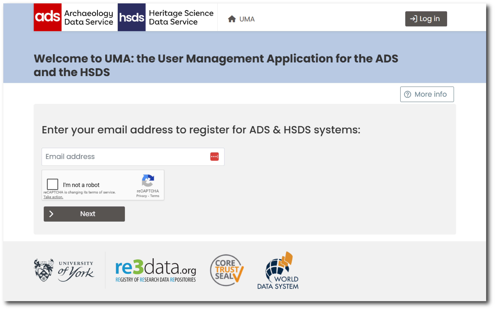

# How to register

To use Ingest, you will first need to register via the [User Management Application](https://archaeologydataservice.ac.uk/uma/index.xhtml) (UMA). You can access this system on the Ingest homepage by clicking 'Create an Account' under the login panel.

<figure markdown="span">
  { width="550" }
  <figcaption></figcaption>
</figure>

## User Management Application

UMA is a centralised platform for managing user accounts and access permissions across ADS and HSDS services. You can use UMA to manage your own personal data and, if an Admin user, manage users for your organisation.

<figure markdown="span">
  { width="550" }
  <figcaption></figcaption>
</figure>

To register, enter your email address and complete the reCAPTCHA verification. Then enter your details, including a password. You can also add (or create) an [ORCID](https://orcid.org/). You will need to accept the Terms and Conditions and privacy policy and press "save details". After submitting your registration, you'll receive a verification email. Check your inbox and click the verification link to activate your account.

For more information see the [UMA help pages](https://archaeologydataservice.ac.uk/uma/help.xhtml#register). 

Once registered for UMA you will be able to manage your account and login to Ingest using the same login credentials.