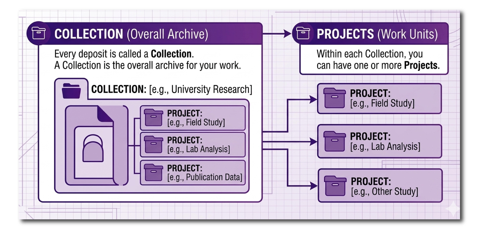

# How you should structure your collection

Ingest has been designed to allow depositors to upload digital content and associated metadata securely to the ADS and HSDS. 

Every deposit is called a *Collection*. A Collection is the overall archive of your work. This is the same as a collection that you will have seen in the [ADS Archives](https://doi.org/10.5284/1136080).

<figure markdown="span">
  { width="450" }
  <figcaption></figcaption>
</figure>

Within each Collection, you can have one or more *Projects*.  Projects are the different facets within a Collection. How you use projects within your collection will be determined on the scope of your work and how you would like your collection to be structured. 

For example:
 
* For a developer-led project it might be different phases of a fieldwork project (i.e. evaluation, excavation).
* For a research project it might include different aspects of your funded project (i.e. database, scientific analysis)
* For a community archaeology project it might include different aspects of community engagement (i.e. archival search, 2021 fieldwalking survey, community workshop).

If you have a very large project, such as an [infrastructure project](https://doi.org/10.5284/1081262), road scheme or railway line, you can also organise your sites into a series of collections. These collections can be organised under a [single umbrella collection](https://doi.org/10.5284/1113008). 

If you are unsure of how to organise your collection, contact the [Helpdesk](https://archaeologydataservice.ac.uk/contact/) for assistance.
