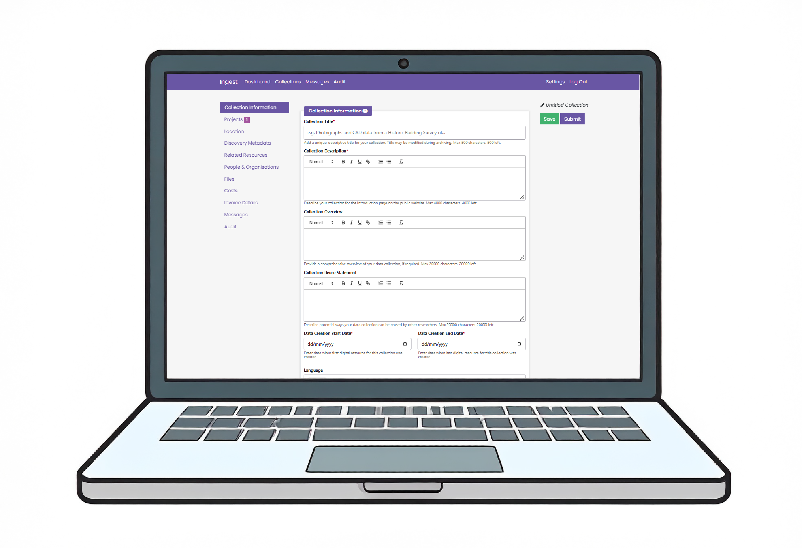

# Welcome to Ingest

The new digital deposit system for the [Archaeology Data Service](https://archaeologydataservice.ac.uk/) and [Heritage Science Data Service](https://hsds.ac.uk/).

__Ingest__ enables researchers, field archaeologists, and heritage professionals to deposit and preserve archaeological and heritage datasets through an intuitive interface.

Developed to streamline the process of archiving digital data and associated metadata, this system represents a significant advancement in our deposition capabilities. 

{ align=right }

__Ingest__:

* Is quick to use
* Supports multiple file formats
* Facilitates all types of deposits (small to large)
* Automates metadata extraction using a single template
* Validates your files and metadata during deposition
* Seamlessly integrates with existing research workflows

## Navigation features
* Use the navigation tabs below to header to search for overall information
* Click headings in the sidebar to navigate to topics more quickly
* Use the search bar at the top of the page to find specific topics
* On mobile devices, tap the menu icon (☰) in the top left hand corner to access the navigation pane.

!!! note "**Pro tip**"

    Use the search function at the top of the page to quickly jump to any topic across the entire guide.

-----

Begin with the ‘Getting Started’ menu to understand the setup of the system.

Read to start depositing? Jump to the ‘New Collections’ tab below the header to head straight to documentation that will help you upload your collection.