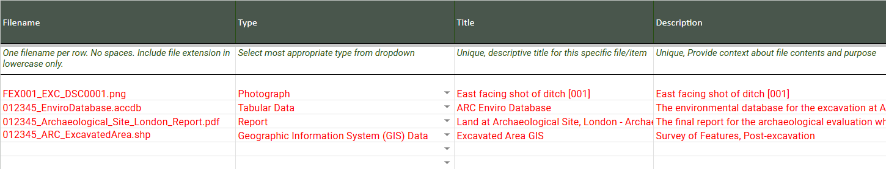

# Metadata Template

This document provides guidance for completing the Metadata Template for deposition into ADS Ingest. Accurate and complete metadata ensures that your digital deposit is discoverable, usable, and properly preserved in our archive.

## Instructions

Prior to using the Ingest system, you should organise the data you would like to deposit and create appropriate metadata.

Download the metadata template (linked below) and complete for all objects that you would like to ingest. Each line of the template will describe a single object that you would like to deposit.

Please complete this template prior to submitting your data via ADS Ingest, as this file will be utilised to validate the files that you are depositing with the ADS.

!!! info "Important"

    It is important that the details listed below are correctly formatted to allow for autonomous ingest of data into the system. Any errors will be highlighted during the deposit process but must be amended before the deposition can proceed.

## Template Download

A .xlsx version of the Metadata template can be downloaded from the following link:

[Download Template](assets/metadata_template.xlsx){ .md-button .md-button--primary }

The Template contains example data to assist in completing the form. Please delete this data before uploading via the Ingest system.

## Folder Structure

When depositing files in the Ingest system you can structure your data in one of two ways:

* Deposit all you files within a single folder
* Deposit your files within a series of sub-folders contained within a single folder

The easiest method for depositing your files is to save all of your files within a single folder and then drag and drop that folder into the Ingest system. However, you may have organised your files within a specific and logical [data structure](https://archaeologydataservice.ac.uk/help-guidance/instructions-for-depositors/data-structure/) that relates to your project. If so, this folder structure can be accommodated within the Ingest process. To ensure the system will recognise your files, include the sub-folder name within the filename in the metadata template. 

### An example

Your fieldwork project is seperated into a series of subfolders, that reflect the types of files that are to be deposited. For example:

project/

    └─ gis/

    └─ report/

    └─ photos/
    
    └─ post-ex/

These folders can be accommodated in the metadata template by pre-fixing the filename with the corresponding subfolder name. For example: 

* *gis/Shapefile.shp*
* *report/012345_Archaeological_Site_London_Report.pdf*
* *photos/Photograph_001.jpg*
* *post-ex/012345_EnviroDatabase.accdb*

Here's an example of correctly referenced subfolder files in the metadata template:

## Field Guidelines

The following section provides detailed guidance for each field in the metadata template including descriptions and examples. The fields denoted with a * are required fields

### __Filename *__
Enter name of file. Please include only one object per row, including the file extension in lowercase. Filenames must only contain alpha-numeric characters (a-z, A-Z, 0-9), hyphens (-), underscores (_) or forward slashes (/).

If you are depositing shapefiles, or other objects where multiple files make up a single item, please include only one object per row. Further details are provided below under 'Multiple files per object'. 

* Example - *012345_Archaeological_Site_London_Report.pdf*
* Format - Free text field

### __Type *__
Enter the type of file uploaded from the drop down provided. This field has a [controlled vocabulary](./appendix_controlled_vocabs.md).

* Example - *Photograph*
* Format - Controlled Vocabulary

### __Title *__
Enter a short descriptive title for users of the ADS website and for ongoing management. Please ensure that this title is unique within your collection.

* Example - *Land at Archaeological Site, London - Archaeological Evaluation Report*
* Format - Free text field

### __Description *__
Enter a short description, expanding upon the title, for users of the ADS website, and for ongoing management.  The description may include information about the contents and purpose of the file, along with any dependencies or relationships to other files.

* Example - *East facing shot of ditch [001]*
* Format - Free text field

### __Tag__
Enter any tags or keywords that describe the content of the item.  These descriptive terms or phrases can include particular places, people, time periods (where interpretation allows), or subjects.  Please separate multiple terms or phrases with a comma (,).

* Example - *Roman, Ditch*
* Format - Free text field

### __Creator *__
Enter the names of any individuals you would like to credit with the creation of, or contribution to, this file.  Please separate multiple names with commas (,). If the creator has an [ORCID](https://orcid.org/) please provide the full link in brackets () at the end of the name.

* Example - *Nicholas Jones (https://orcid.org/1234-5678-9101-1121)*
* Format - Free text field

### __Copyright Holder *__
Enter the person or organisation that holds Copyright for this digital object. If this is a named person please follow the Guidance as for [Creator](#creator). If the Copyright Holder is an organisation please enter the name followed by *(org)*. Please separate multiple names or organisations with a comma (,).

* Example - *ARC Company Ltd (org)*
* Format - Free text field

### __Creation History *__
Enter a short description of how this object was created, including what tools/software/processing was involved. Please separate multiple entries with commas (,).

* Example - *Microsoft Word, Originally scanned using HP scanner 5.6, edited in Adobe Photoshop*
* Format - Free text field

### __Language__
Enter a language if the digital object contains text elements, or integrated metadata. This is not necessary for image content. Please separate with commas (,) if multiple languages are included.

* Example - *English*
* Format - Free text field

### __Date File Digitally Created *__ 
Enter the date this digital object was created. If this is a scan or replication of historic works please use the date of the digital creation.

* Example - *23/03/2021*
* Format - Date (DD/MM/YYYY format)

### __Additional Metadata__
Enter a filename for any additional metadata. For specific data types, the ADS requires additional technical metadata. Guidance on this technical metadata is provided in the [ADS Instructions for Depositors](https://archaeologydataservice.ac.uk/advice/Downloads.xhtml). Please use an ADS generated template. If using multiple files, separate with a comma (,).

* Example - *012345_ADS_database_metadata_Enviro_v2.xlsx*.
* Format - Free text field

### __Survey Area (Hectares)__ 
For "Geophysics" data type only. Enter the total area of the geophysical survey in hectares. Decimal points are allowed. If 'Geophysics' is selected in Type, then this field is also required.

* Example - *3.6*
* Format - Numeric

## Multiple files per object

In some instances you may wish to upload a single object that contains multiple files, such as a shapefile. In this case please add all files to the upload folder and include only one object (or row) in the metadata template. The Ingest system will recognise all of these files as a single object, but only if all files contain the same filename. 

For example, a shapefile object may consist of the following files:

* example.shp
* example.shx
* example.dbf
* example.sbn
* example.prj

However, all of these files can be listed as a single row in the metadata template, using the filename 'example.shp'. This ensures all files related to an object are ingested together and contain the same metadata. An example is listed in the template, which can be downloaded above.