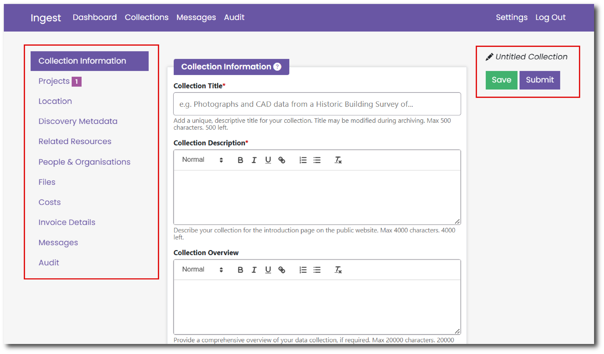
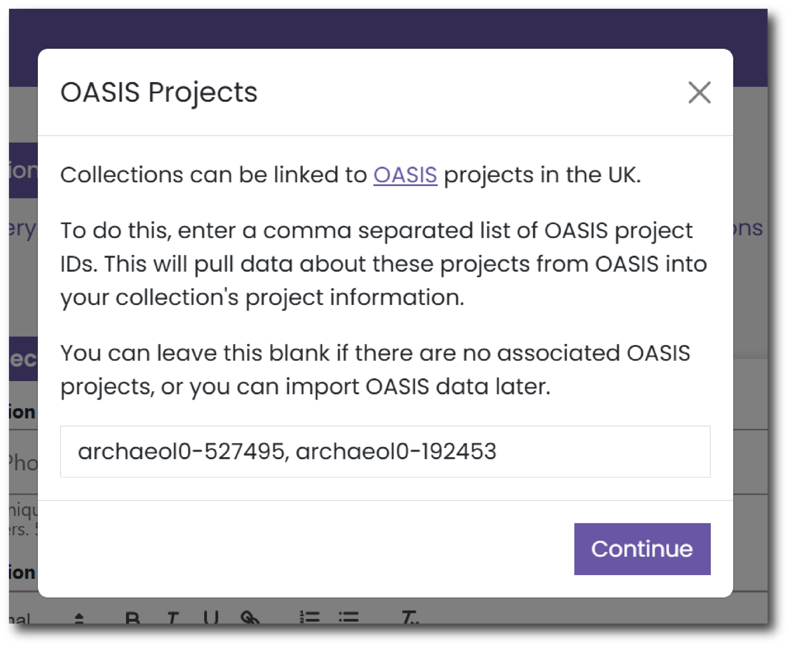

# Submitting a New Collection

To submit a new collection for deposition click the green ‘New Collection’ button at the top of the home page.

<figure markdown="span">
  { width="550" }
  <figcaption></figcaption>
</figure>

You can navigate through the Collection menu using the links to each page on the left hand side of the screen. 

You can save your progress using the green ‘Save’ button on the right hand side of the screen. Once all mandatory fields are complete you can also submit your collection using the purple ‘Submit’ button on the right hand side of the page.

Once you have completed the Collection Title on the [Collection Information](./nc_collection_info.md) page, the title will appear above the Save and Submit buttons.

## OASIS Projects

If you have already submitted information about your project to OASIS you can link to this existing information and automatically pull details into Ingest.

OASIS is the online system for reporting investigations into the historic environment and linking research outputs and archives.

To do this, enter the OASIS ID into the pop-up box that appears once you hit the green ‘New Collection’ button.
You can also automatically pull details from multiple OASIS projects. To do this, enter a comma separated list of OASIS IDs. 

<figure markdown="span">
  { width="450" }
  <figcaption></figcaption>
</figure>

If there are no associated OASIS projects, you can leave this field blank and just hit Continue. 

You can also import OASIS data later via the [Projects page](./nc_projects.md).