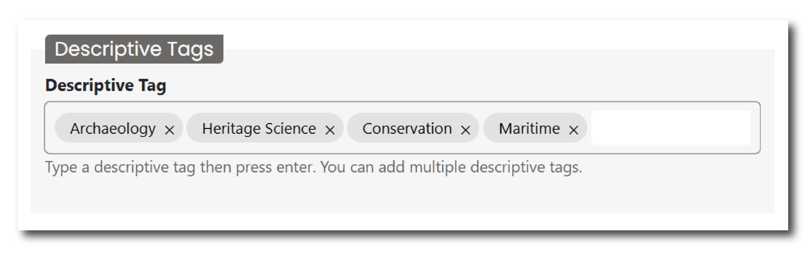
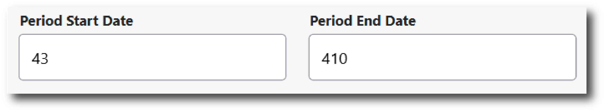
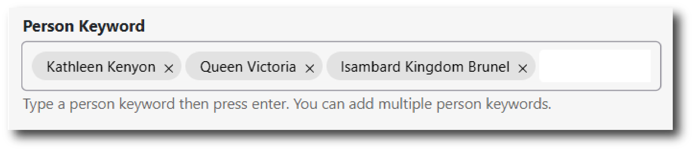
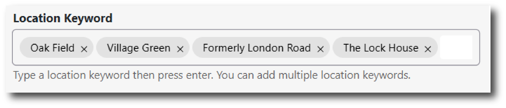

This page of the deposition is designed to gather additional metadata that will make it easier for others to find your dataset, via platforms like the [ADS Data Catalogue](https://archaeologydataservice.ac.uk/data-catalogue/) or [HSDS Data Catalogue](https://hsds.ac.uk/data-catalogue/), and what it contains. 

Some of this information is collected via the keywords on the [Projects page](../nc/nc_projects.md). However, unlike the controlled vocabularies found there, the Discovery Metadata page allows you to enter custom tags and keywords that reflect your collection.

### Descriptive Tags

Please enter any tags that describe your collection or its content. These tags could relate to the themes of the collection, the methods that you used to undertake your fieldwork and/or research, or anything else that you think is important or unique.

Some examples could be: 

<figure markdown="span">
  { width="450" }
  <figcaption></figcaption>
</figure>

To enter a tag, type into the field and press enter. The tag will now appear within a small grey bubble. To remove the tag, click the ‘x’ next to the relevant word.

### Period Dates

Please enter a start and end date of the historical period that covers the contents of your entire collection. If years in prehistory (i.e. before BC), please enter a ‘-’ sign before the number. Period names (e.g. the Bronze Age, the Roman period) are defined alongside Keywords in the [Project](../nc/nc_projects.md) pages.

An example could be: 

<figure markdown="span">
  { width="450" }
  <figcaption></figcaption>
</figure>

### Person Keywords

Please enter any keywords of any historical or modern people that are connected to your collection. This could include people who are the subject or focus of the archive, such as materials from a famous archaeologist; people who are depicted in the resource, such as a statue of a historical figure; creators or designers of objects or places within the archive, such as an engineer who designed a bridge; or people associated with events or locations depicted in the archive, such as a notable person who inhabited a building.

This would likely not include people involved in your project - this data is collected on the [Project](../nc/nc_projects.md) and [People and Organisations](../nc/nc_people.md) pages.

Some examples could be: 

<figure markdown="span">
  { width="550" }
  <figcaption></figcaption>
</figure>

To enter a keyword, type into the field and press enter. The tag will now appear within a small grey bubble. To remove the keyword, click the ‘x’ next to the relevant word.

### Location Keywords

Please enter any keywords that describe the geographic location of your project or collection. These keywords are usually terms that would extend the information collected on the [Collection Information](../nc/nc_collection_info.md), [Project](../nc/nc_projects.md), or [Location](../nc/nc_location.md) pages. They could include a specific place name, site or name of a building.

Some examples could be:

<figure markdown="span">
  { width="550" }
  <figcaption></figcaption>
</figure>

To enter a keyword, type into the field and press enter. The tag will now appear within a small grey bubble. To remove the keyword, click the ‘x’ next to the relevant word.