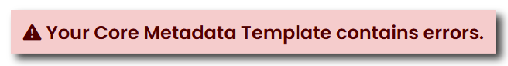
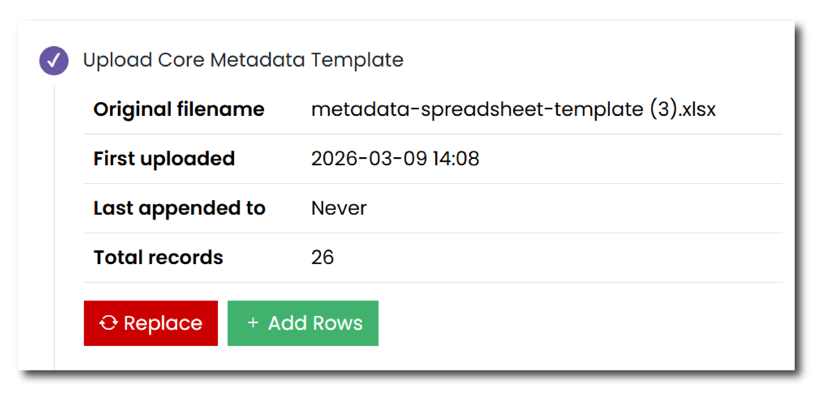
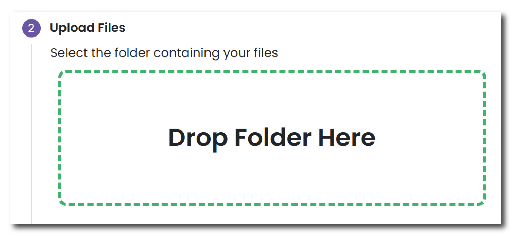
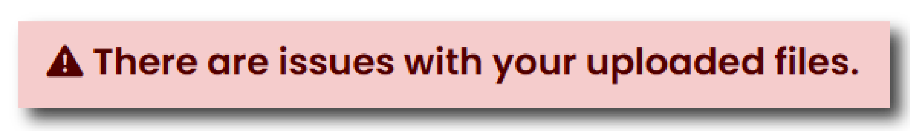
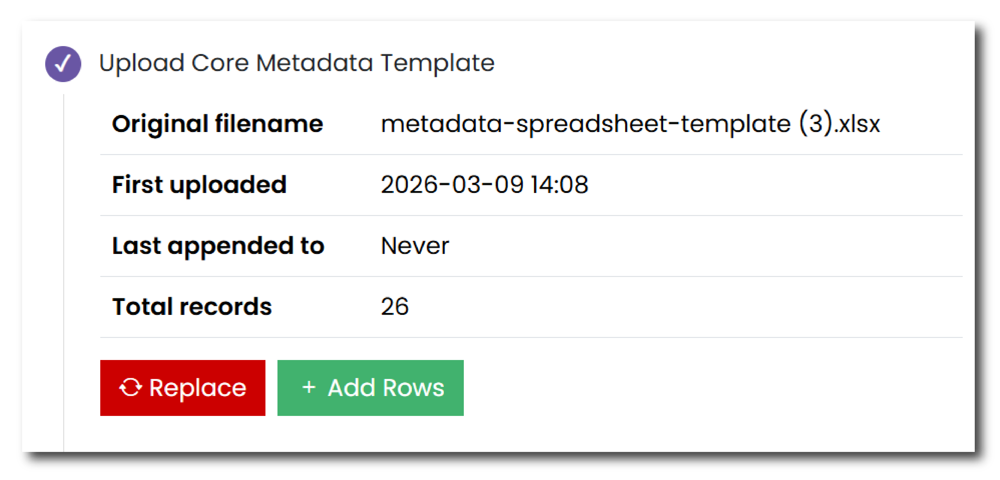

This page is where you upload the data and metadata that forms your collection. Download the Core Metadata template and fill in a row for each digital object. 

A digital object can be a single file or a group of files relating to a single object, such as a 3D model or a GIS shapefile.

Further information about how to complete the Core Metadata Template, can be found in the [Metadata section](../cmt/cmt_index.md).

**Step 1 - Upload Core Metadata Template**

Begin by downloading the Core Metadata Template using the link provided. All of the metadata for the data in your collection can be compiled within this single and easy to use template. 

The template contains some example entries as well as additional information to help you complete the necessary fields. For more details about how to complete the Metadata template, please view the [Core Metadata template](../cmt/cmt_index.md) guidance.

Once your metadata template has been completed, click the ‘Select File’ button and navigate to the location of the template on your computer. After you upload your template the system will automatically review your file and identify if there are any errors. 

<figure markdown="span">
  { width="450" }
  <figcaption></figcaption>
</figure>

The errors will describe what information is missing or incorrect and how to rectify the issue. If you have multiple errors you can click the ‘Show more’ and 'Show all’ buttons to expand the list. 

You must rectify your errors and re-upload the Core Metadata template before you can continue.

Once you have rectified any errors, or if your metadata template file does not have any errors, then you will be shown a summary.

<figure markdown="span">
  { width="550" }
  <figcaption></figcaption>
</figure>

The summary includes:

* The name of the file  
* When it was first uploaded  
* When it was last appended to  
* How many total records have been uploaded to the system.

At this stage, the metadata uploaded can be amended in two ways.

Press ‘Replace’ to replace the metadata template with an alternative or updated version.

Press ‘Add Rows’ to select an additional core metadata template that contains additional metadata information. Please note that if this file contains the same information as the first template uploaded, then the system will highlight these duplicates as errors.

You can then proceed to the next step.

**Step 2 \- Upload Files**

Once your metadata template is complete and uploaded to the system, you can now start to upload the files that you would like to deposit.

To do this drag and drop a folder containing your files into the 'Drop Folder Here' box. Please note that the folder must not be compressed in any way (e.g. zipped) to upload it to the system.

<figure markdown="span">
  { width="550" }
  <figcaption></figcaption>
</figure>

As you add the data, the system will process the files and automatically highlight any issues. These may be mismatches between the files you have deposited and the core metadata template. To navigate these issues you can click on the underlined errors and it will expand the list to show all of the files that are affected.

<figure markdown="span">
  { width="450" }
  <figcaption></figcaption>
</figure>

To rectify these issues you have two options:

* __Click Fix Issues__ - This button takes you to a separate page where you can rectify any specific issues per item. On this page you will be able to add new files, remove rows from the metadata template, as well as other options, to rectify any issues.  
* __Click ‘Re-upload files’__ - This button will take you back to the start of this step and ask you drag and drop a folder containing your files into the 'Drop Folder Here' box.

Once all of the errors have been rectified you will be shown a summary of the files deposited. You can examine your files by clicking the ‘Browse Files’ button under the summary. On the ‘Browse Files’ window you can navigate through your files and download a file list.

You can then proceed to the next step.

<figure markdown="span">
  { width="550" }
  <figcaption></figcaption>
</figure>

**Step 3 \- Interface Options**

Once the metadata and files that comprise your collection have been uploaded and verified, you can now customise the appearance of your collection when it is published.

**Introduction Page Image** \- Please select a picture from the files deposited that will appear on the Introduction Page. 

**Overview Page View** \- Please select a picture from the files deposited that will appear on the Overview Page. Please note that if you did not fill in the Collection Overview section on the [Collection Information page](nc_collection_info.md), please do not select a photo in this dialogue box.

**Select your preferred download page structure \-** Please select the way that you would like your data to be structured on the download page. The default option is by data category. You can also determine a specific structure that matches the folder structure of the data uploaded as part of your deposit. We recommend no more than three folder levels if possible. We can not guarantee an exact replication of your uploaded folder structure and may need to contact you to discuss your preferences further.

**Please indicate if you are interested in discussing a special collection interface** \- If you would like to create a special collection interface for your collection, please select yes and an archivist will be in touch with you to discuss your options. A special collection interface is a bespoke interface that reflects the specific structure of your data and could include additional features such as a [search query](https://archaeologydataservice.ac.uk/archives/collections/view/1003796/query.cfm) or an [interactive map interface](https://archaeologydataservice.ac.uk/archives/collections/view/1004060/map.cfm). This option would incur further costs.

Once you have selected these preferences, your file upload has been completed and you can navigate to the next page.
