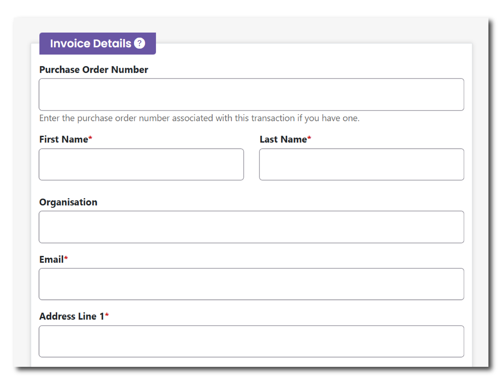

This menu allows you to enter the details associated with invoicing for the cost of your deposition. You should enter the contact details of a person who is responsible for ensuring the payment of invoices so as to not delay the deposition and publication of your collection.

<figure markdown="span">
  { width="350" }
  <figcaption></figcaption>
</figure>

Default Invoice Details can be updated via the Settings menu. This ensures that you do not have to re-enter invoice details for every collection. The default options can be changed within this page menu if required.

### Purchase Order Number

If your invoice is associated with a Purchase Order number from your organisation, please enter these details here so that our Finance team can include this information on invoices sent to your nominated contact.

### Name (first and last name)

Please enter the first and last name for your nominated contact. This is a mandatory field.

### Organisation

If applicable, please include the name of your organisation.

### Email

Please enter the email address for your nominated contact. This is a mandatory field.

### Address 

Please enter the physical address associated with your organisation or nominated contact. This is a mandatory field.

### Additional Details

This field allows you to provide extra details regarding the invoicing for this transaction. You may include special instructions or any notes that will assist in processing the invoice effectively.