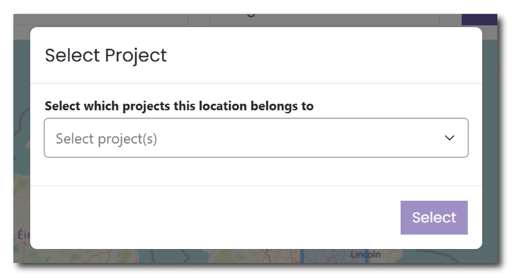

This menu allows you to provide the geographic location for your project(s). To do this you can use the intuitive map interface and the tools found within the map.

### Searching the Map

Above the map, there are a number of ways in which you can find the location of your project:

* __Search for a location__ - Type in a place name to focus your search  
* __British National Grid reference__ - Use the grid tile letters followed by a full six or eight numeric grid reference (e.g. NZ250638) to focus your search.  
* __Eastings and Northings__ - Use the British National grid reference, separated into a six or eight figure easting and northing (e.g. 425034 , 563870), to focus your search.  
* __Latitude and Longitude__ - Use the World Geodetic System 1984 Reference System (e.g. 54.968824 , \-1.6104931), to focus your search.

Using any of the methods above will centre the map of the desired location but will not yet select this location for your project. Use the Zoom function to move.

### Selecting a location

To select a geographic location you can use one of three tools:

| Tool | Description | Icon |
| ----------- | ----------- | ----------- |
| **Draw a polygon** | Use this option to create a bespoke shape for your project area. Click to create a node and click the first point to close the shape. Clicking on this option opens a small menu that allows you to ‘Finish’ the shape, ‘Delete the last point’ and ‘Cancel’ creating the polydon. |  | 
**Draw a rectangle** | Use this option to create a bespoke shape for your project area. Click to create a node and click the first point to close the shape. Clicking on this option opens a small menu that allows you to ‘Finish’ the shape, ‘Delete the last point’ and ‘Cancel’ creating the polygon. |  | 
**Draw a marker** | Use this option to create a single marker for your project. Click on the map once to place your marker. Clicking on this option opens a small menu that allows you to ‘Cancel’ creating the marker. |  |

### Editing your locations

Once you have created a polygon, rectangle or marker you are able to edit these points using the ‘Edit layers’ and ‘Delete layers’ tools.

| Tool | Description | Icon |
| ----------- | ----------- | ----------- 
| **Edit layers** | Click on this tool to edit any existing layers. Once you click this tool all existing layers will be highlighted. Click and drag existing nodes to change the shape of a polygon or rectangle or move the location of a marker. Clicking on this option opens a small menu that allows you to ‘Cancel’ any edits. Make sure to hit ‘Save’ after you finish editing these layers.  |  
| **Delete layers** | To remove any of these layers, click on this tool and then select any layers to delete them entirely. Clicking on this option opens a small menu that allows you to ‘Cancel’ any edits, ‘Save’ any edits that you have made or ‘Clear all’ to remove all layers that currently exist on the map. |  |

### Allocating a location to a Project

When you allocate a point or polygon on the map, the system will ask what project this location belongs to. 

<figure markdown="span">
  { width="350" }
  <figcaption></figcaption>
</figure>

This allows you to assign a spatial reference to each individual project. If you do not assign a spatial reference to your project then no coordinates will be assigned to your collection in the ADS.