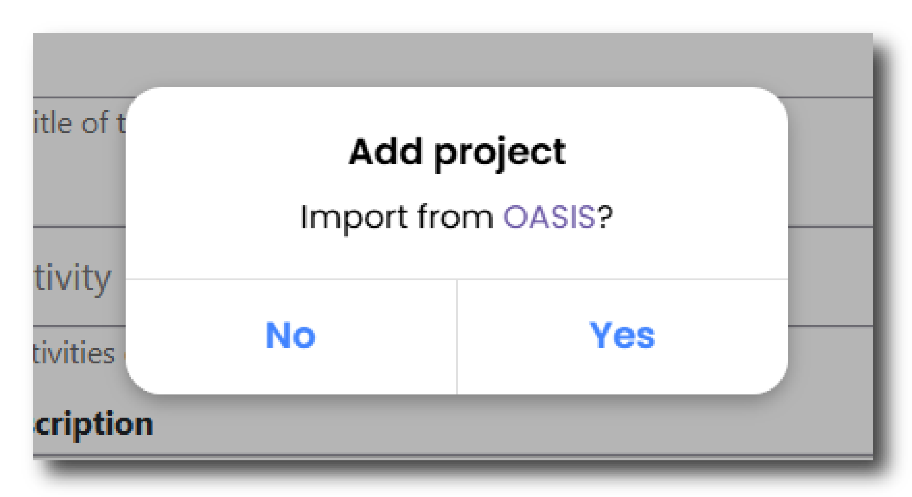
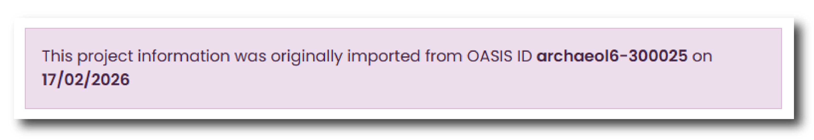
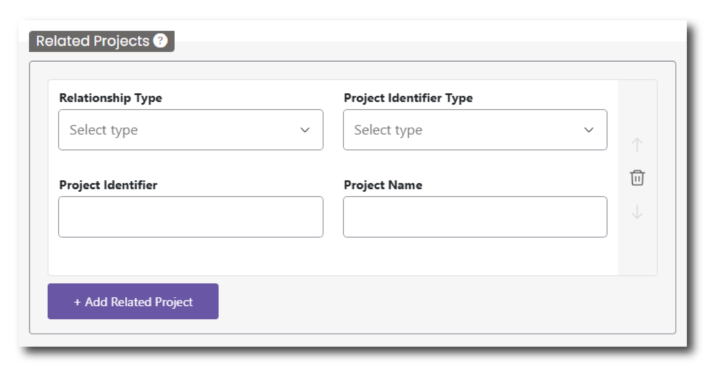

# Projects

This page of the deposition is designed to gather information about the Project or Projects that form part of the overall Collection. A project(s) is the different facets within a collection - they could represent different phases of a fieldwork project, different stages of a research project or different aspects of a community archaeology project.

For more information about the difference between Collection and Projects please read the [How you should structure your collection](/docs/gs/gs_structure.md) section.

The structure of your Collection into different Projects will inform the overall structure of your Collection into different sub-sections as it appears on the ADS or HSDS website. 

## Importing from OASIS

Just in the same way as you can import OASIS projects when you start a ‘New Collection’, you can also achieve this via the Projects page. Importing information from OASIS is useful to save you time re-entering information and to ensure that the fields in these different databases align with one another.

To import from OASIS, click the ‘Add Project’ tab at the top of the page. A pop up menu will appear asking if you want to ‘Import from OASIS’. Click Yes and input the OASIS project ID. 

<figure markdown="span">
  { width="250" }
  <figcaption></figcaption>
</figure>

Relevant details from the OASIS project will automatically populate fields in this menu and a notification will appear at the top of the page.

<figure markdown="span">
  { width="450" }
  <figcaption></figcaption>
</figure>

Information imported from OASIS can be amended in the Project menu, however, we would recommend returning to OASIS to update any entries prior to importing your data, as any changes will not be reflected in OASIS and as such the records will not correspond with one another.

## Multiple Projects

Multiple projects can be added under a single collection. To add a second project scroll to the top of the page and click the “+ Add Project” button. This will create a new menu, which can be accessed as a second tab along the top of the Projects menu Here you can import a OASIS project (as outlined above) or add details manually.

If you created too many projects or would like to remove a project, scroll to the bottom of the page and click the red ‘Remove Project’ button. Please note that once a project has been removed, you will not be able to recover this information.

For more information about the relationship between Collections and Projects please read [How you should structure your collection](gs_structure.md).

## Project Name

Please provide a name for your project. Make sure the name of the project is clear and properly describes the activities undertaken within that project. This is a mandated field.

## Activities

Using the dropdown list provided, please describe the activities or tasks that were undertaken as part of this project. Type in the activity into the bar to search available options. You can select more than one option. To remove an option, click the ‘x’ next to the name of the activity.

## Project Description

Include a description of your project including key objectives, methodology, and significance. You may also include details about the scope of work, fieldwork dates, and expected outcomes. This description should relate to this particular project within your Collection and should not repeat the information from ‘Collection Description’. If you have a single project within your collection, this field may provide more contextual information about what work or research was undertaken that led to the creation of this Collection. This field allows you to enter a maximum of 20,000 characters.

## Fieldwork Start Date

Enter the date when the information-gathering phase of the project began. This may coincide with the start of fieldwork or a research project. This is a mandatory field. 

## Fieldwork  End Date

Enter the date when the information-gathering phase of the project was completed. This may coincide with the end of fieldwork or a research project. This is a mandatory field. 

## Project Identifiers

Please add any unique Identifiers that relate to your project. This allows us to link your collection to other databases and/or a physical archive.

To add a Project Identifier, click the “+ Project Identifier," button and fill in the following:

* Project Identifier Type - From the drop down list select the appropriate identifier type, such as site code or museum accession identifier.
* Project Identifier - Type in the identifier that relates to the Identifier Type selected above.

## Keywords

This menu allows you to add Keywords that reflect your project’s key research findings or subjects.  Keywords are important as they help us to make your Collection as Findable and Accessible as possible via our Data Catalogues and other catalogues.

To add a Keyword, click the “+ Keyword" button and fill in the following:

* Subject Keyword Type - From the drop down list select the appropriate thesaurus of subject keywords to search based on the monument or objects you are describing and its location within the UK.
* Subject Keyword - Search for your subject keyword. Type in a keyword and this menu will filter to the appropriate option. Based on the Subject Keyword Type, this menu will search the appropriate thesaurus of subject keywords
* Period Keyword Type - Pair your keyword with the relevant time period. Select the location within the UK to search appropriate thesaurus of period keywords.
* Period Keyword - Search for your subject keyword. Type in a period and this menu will filter to the appropriate option. Based on the Period Keyword Type, this menu will search the appropriate list of periods within the UK.

This is a mandatory field. Please ensure at least one keyword has been added but please add as many as is necessary to sufficiently describe your project.

### Other

If you cannot find a suitable keyword in either ‘Subject Keyword Type’ or ‘Period Keyword Type’, there is an option to choose ‘Other’. With this option you can manually type in a subject or period keyword. This option should only be used if a suitable alternative cannot be found in the listed thesauri. If manually typing in a keyword please ensure that this is directly relevant to your project. 

If you have imported your Project from OASIS, any keywords completed in OASIS would have been autofilled for you. This information can be amended in this menu, however, we would recommend returning to OASIS to update any entries prior to importing your data, as any changes will not be reflected in OASIS and as such the records will not correspond with one another.

## Related Projects

This menu allows you to include information about any complementary or associated projects. To add a Related Project, click the “+ Related Project" button and fill in the following:

* Relationship Type - From the drop down list select whether it is ‘Part of’ or ‘Related’ to your project
* Project Identifier Type - From the drop down list select whether the Project identifier is sourced from ‘OASIS’ or ‘Other’
* Project Identifier - The identifier by which the related project is known by (e.g. somear1-511984, SJB26)
* Project Name - The name by which this related project is known by (e.g. A Field Evaluation at London Way, Middlesbrough, RS1 4JK)

<figure markdown="span">
  { width="450" }
  <figcaption></figcaption>
</figure>

## Reason for Project

Using the dropdown list provided, please select the primary reason for undertaking the project. This could be for Planning purposes, as part of a developer-funded project, or as part of a Research project, among other options. If none of the options relate to your project, please select ‘Other’.