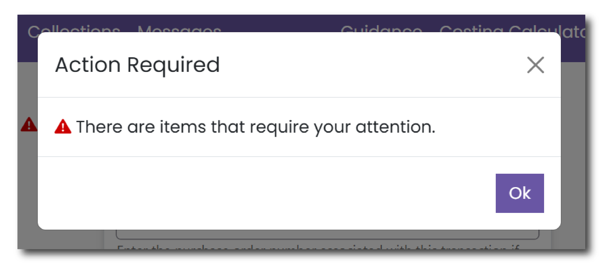
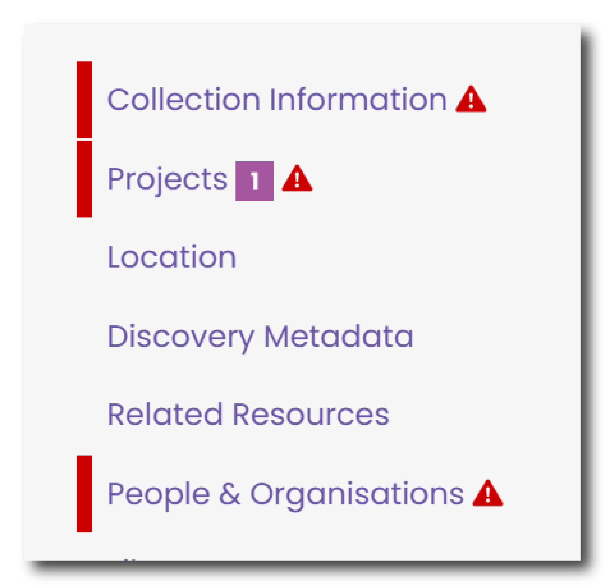
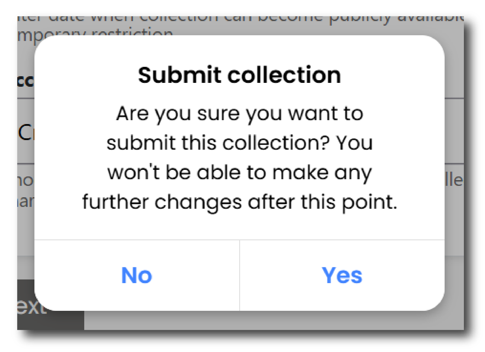
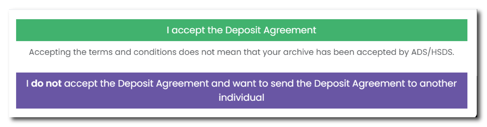
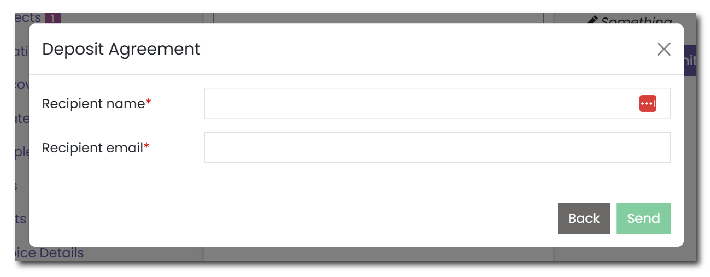

# Submitting a Collection

Once all mandatory fields are complete, and you have uploaded the Core Metadata Template and files, you can submit your collection using the purple ‘Submit’ button on the right hand side of the page.

## Actions Required

The Ingest system will then validate all the inputted information and let you know if additional actions are required.

<figure markdown="span">
  { width="350" }
  <figcaption></figcaption>
</figure>

If so, click 'Ok' and navigate through the Collection menu on the left hand side of the screen. Menus highlighted in red require some attention. Within each menu, fields that require action will also be highlighted in red.

<figure markdown="span">
  { width="250" }
  <figcaption></figcaption>
</figure>

Once all of the actions have been addressed, again click the purple ‘Submit’ button on the right hand side of the page to submit your collection.

If all actions have been addressed, a warning will be displayed to remind you that once the collection has been submitted you will no longer be able further changes. 

<figure markdown="span">
  { width="250" }
  <figcaption></figcaption>
</figure>

!!! note "**Please Note**"

    If you need to add or edit any information in your collection after it has been submitted you will need to contact the Archivist working on your collection. You can do this using the [Messages menu](../gs/gs_messages.md).

## Deposit Agreement

Once the collection has been submitted you will be asked to read and sign the online Deposit Agreement.

There are two options:

* Sign the agreement yourself by clicking the green button stating 'I accept the Deposit Agreement'
* Send the Agreement to a nominated person in your organisation by clicking the purple button stating 'I do not accept the Deposit Agreement and want to send the Deposit Agreement to another individual'

<figure markdown="span">
  { width="450" }
  <figcaption></figcaption>
</figure>

If you choose the second option, a new menu will appear where you will have to complete the following information:

* Recipient name - mandatory field
* Recipient email - mandatory field

Click 'Send' to send a the deposit agreement to this selected individual.

<figure markdown="span">
  { width="450" }
  <figcaption></figcaption>
</figure>

## Email Confirmation

Once the Deposit Agreement has been signed, either by yourself or another individual, the signee will receive a confirmation email providing a copy of the following information:

* A copy of the Deposit Agreement (as a pdf file)
* A deposit receipt, providing a list of all the files deposited (as a csv file)
* A copy of the Cost Estimate creating using the [Cost menu](../nc/nc_costs.md) (as a pdf file)

:tada: Congratulations, your collection has now been submitted!